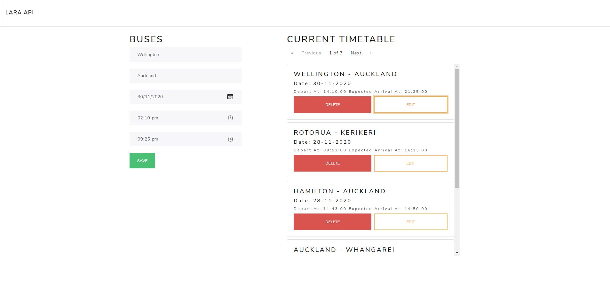

# REST API - Laravel + Vue

## Getting started

```bash
# Install composer Depencies 
$ composer install

# Install node Depencies (bootsrap & vue)
$ npm install
```

```bash
# Migrate tables
$ php artisan migrate

# To generate dummy data
$ php artisan db:seed
```

```bash
# Generate encryption key - may not be required
php artisan key:generate
```

## Endpoints

#### List of all buses with pagination (set to five) & pagination meta data

```php
//::GET http://127.0.0.1:8000/api/buses :://
GET api/buses 	
```

#### Add bus

```php
//::POST http://127.0.0.1:8000/api/buses :://
GET api/buses
```

```json
content-type -- application/json
{
	"depart_loc": "Auckland",
	"arrival_loc": "Hamilton",
	"depart_date": "2020-10-23",
	"depart_time": "11:30:00",
	"arrival_time": "14:20:00"
}
```

#### Show bus

````php
//::GET http://127.0.0.1:8000/api/buses/4 :://
GET api/buses/{id}
````

#### Delete bus

```php
//::DELETE http://127.0.0.1:8000/api/buses/4 :://
DELETE api/buses/{id}
```

#### Updating bus

```php
//::PUT http://127.0.0.1:8000/api/buses :://
```

```json
content-type -- application/json
{
    "id": "4"
	"depart_loc": "Wellington",
	"arrival_loc": "Hamilton",
	"depart_date": "2020-10-23",
	"depart_time": "7:30:00",
	"arrival_time": "14:20:00"
}
```

## About

A simple REST-API written using Laravel resources consisting of full CRUD operations and a Vue front end.

